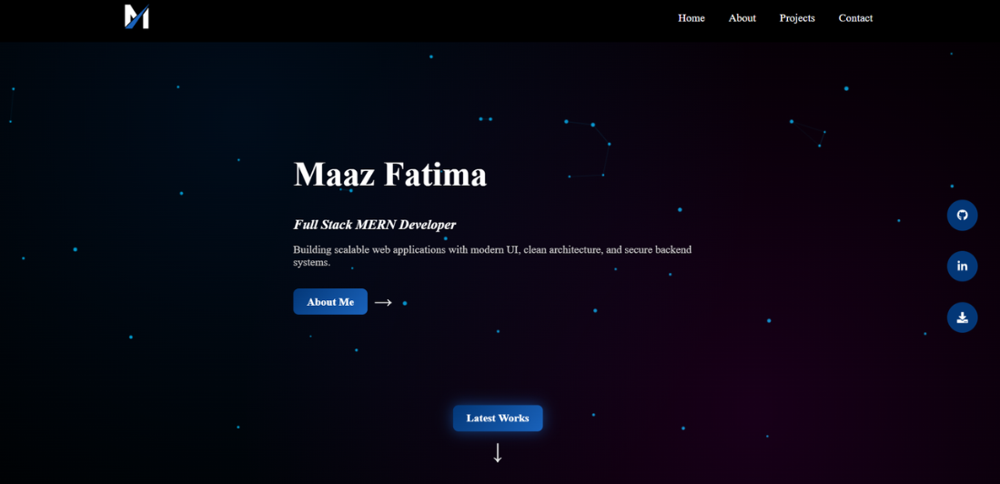
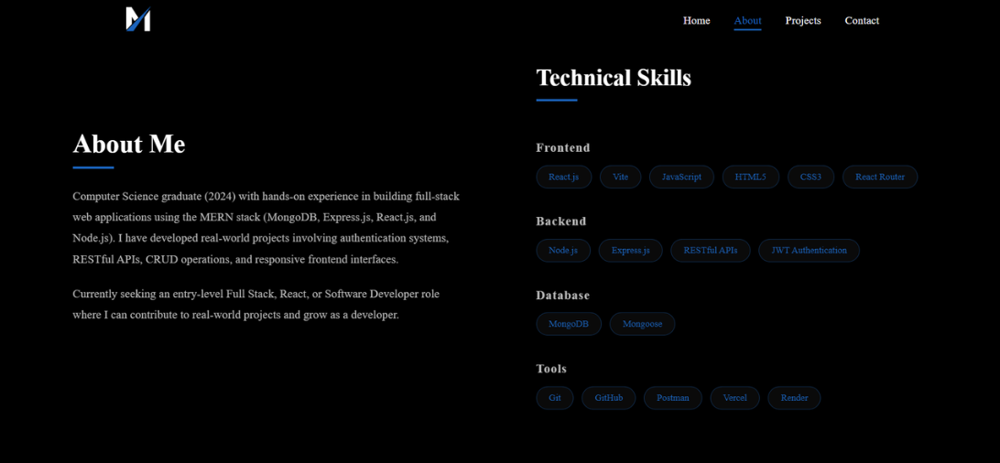
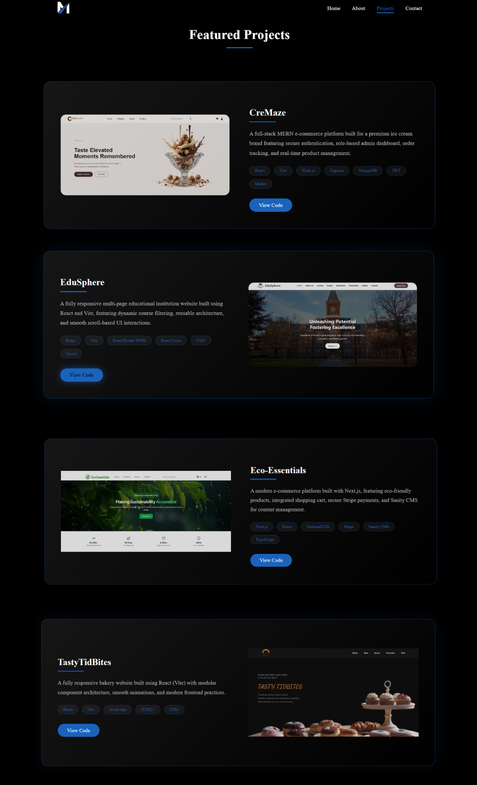
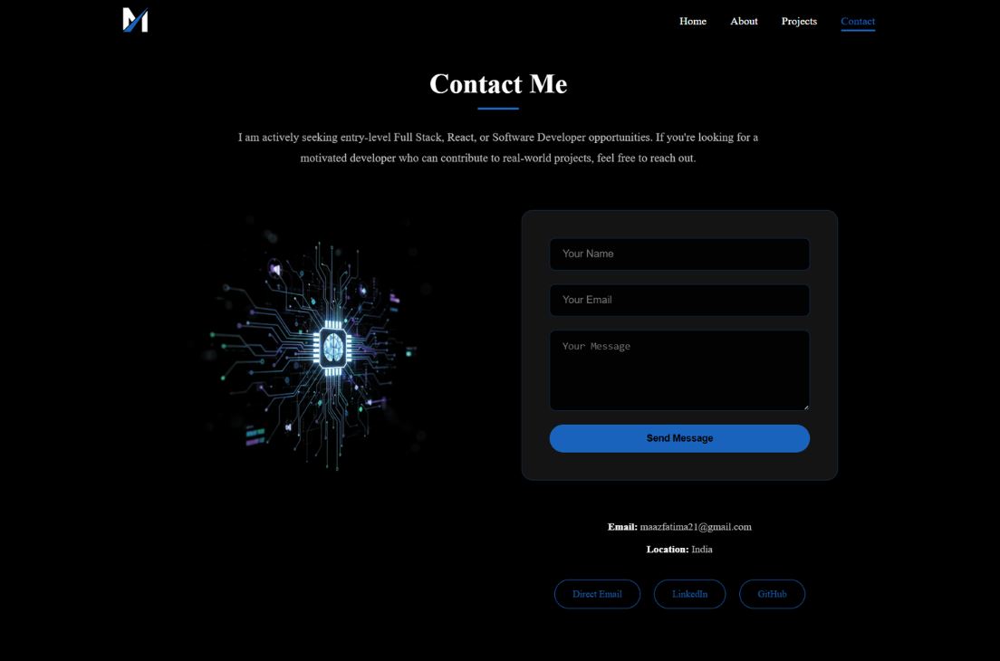

# Maaz Fatima – Full Stack Developer Portfolio

A modern, responsive portfolio website built with React and Vite to showcase my projects, technical skills, and development experience.

## 🌐 Live Demo

👉 **View Portfolio:**  
[https://maazfatimaportfolio.vercel.app/](https://maazfatimaportfolio.vercel.app/)

## Tech Stack

- **Frontend Framework**: React 
- **Build Tool**: Vite 
- **Styling**: CSS3
- **Routing**: React Router v7
- **Icons**: React Icons
- **Email Service**: EmailJS
- **Linting**: ESLint with React plugins
- **Deployment**: Vercel

---

## 🚀 Key Highlights

- Built with modern React architecture (functional components & hooks)
- Fully responsive mobile-first design
- Optimized for performance and SEO
- Clean reusable component structure
- Deployed with continuous deployment via Vercel

## ✨ Features

- 🎨 **Modern UI/UX** – Clean, minimal design with smooth transitions and interactive elements  
- 📱 **Responsive Design** – Mobile-first layout optimized for all screen sizes  
- ⚡ **Performance Optimized** – Fast load times powered by Vite and efficient component structure  
- 📧 **Functional Contact Form** – Integrated with EmailJS for real-time message delivery  
- 🔄 **Client-Side Routing** – Seamless navigation using React Router  
- 🔍 **SEO Optimized** – Structured metadata and semantic HTML for better search visibility

---

## 📸 Screenshots

### Home Page


### About Page


### Project Page


### Contact Page


---

## Project Structure

```
portfolio/
├── public/
│   └── images/              # Static images and assets
├── src/
│   ├── components/          # React components
│   │   ├── About.jsx       # About section
│   │   ├── Contact.jsx     # Contact form
│   │   ├── Hero.jsx        # Hero/banner section
│   │   ├── Navbar.jsx      # Navigation bar
│   │   └── Projects.jsx    # Projects showcase
│   ├── styles/             # CSS stylesheets
│   │   ├── About.css
│   │   ├── Contact.css
│   │   ├── Hero.css
│   │   ├── Navbar.css
│   │   └── Projects.css
│   ├── App.jsx             # Main app component
│   ├── index.css           # Global styles
│   └── main.jsx            # Entry point
├── package.json            # Project dependencies
├── vite.config.js          # Vite configuration
├── eslint.config.js        # ESLint configuration
├── vercel.json             # Vercel deployment config
└── README.md               # This file
```

---

## Installation

### Prerequisites
- Node.js (v16 or higher)
- npm or yarn

### Setup

1. **Clone the repository**
   ```bash
   git clone https://github.com/maazfatima21/Portfolio.git
   cd Portfolio
   ```

2. **Install dependencies**
   ```bash
   npm install
   ```

3. **Set up environment variables** (for using EmailJS)
   ```bash
   # Create a .env file in the root directory
   VITE_EMAILJS_SERVICE_ID=your_service_id
   VITE_EMAILJS_TEMPLATE_ID=your_template_id
   VITE_EMAILJS_PUBLIC_KEY=your_public_key
   ```

---

## Available Scripts

- **`npm run dev`** - Start the development server (http://localhost:5173)
- **`npm run build`** - Build for production
- **`npm run preview`** - Preview production build locally
- **`npm run lint`** - Run ESLint to check code quality

---

## Development

To start developing:

```bash
npm run dev
```

The application will open at `http://localhost:5173` with hot module replacement (HMR) enabled.

## Building for Production

```bash
npm run build
```

This creates an optimized production build in the `dist/` directory.

---

## �️ Image Optimization

To ensure fast image loading in production, follow these best practices:

### 1. **Image Format**
- Convert PNG images to **WebP** format (30-50% smaller)
- Use tools like [CloudConvert](https://cloudconvert.com/) or [ImageOptim](https://imageoptim.com/)
- Fallback to PNG for browsers that don't support WebP

### 2. **Image Compression**
- Compress images without losing quality using:
  - [TinyPNG](https://tinypng.com/) - Free compression
  - [Squoosh](https://squoosh.app/) - Google's compression tool

### 3. **Lazy Loading**
- Images are already optimized with `loading="lazy"` attribute
- This defers image loading until they're needed

### 4. **Recommended Image Sizes**
- Project thumbnails: 800x450px (16:9 aspect ratio)
- Profile images: 400x400px
- Logo: 200x200px

### 5. **Vercel CDN**
- Vercel automatically optimizes images through their CDN
- Ensure images are in `/public` folder for caching

---

## �👩‍💻 Author

**Maaz Fatima**  
Full Stack Developer (MERN Stack)  
Passionate about building scalable web applications and clean UI experiences.  
📧 Open to Full Stack and Frontend Developer roles

---